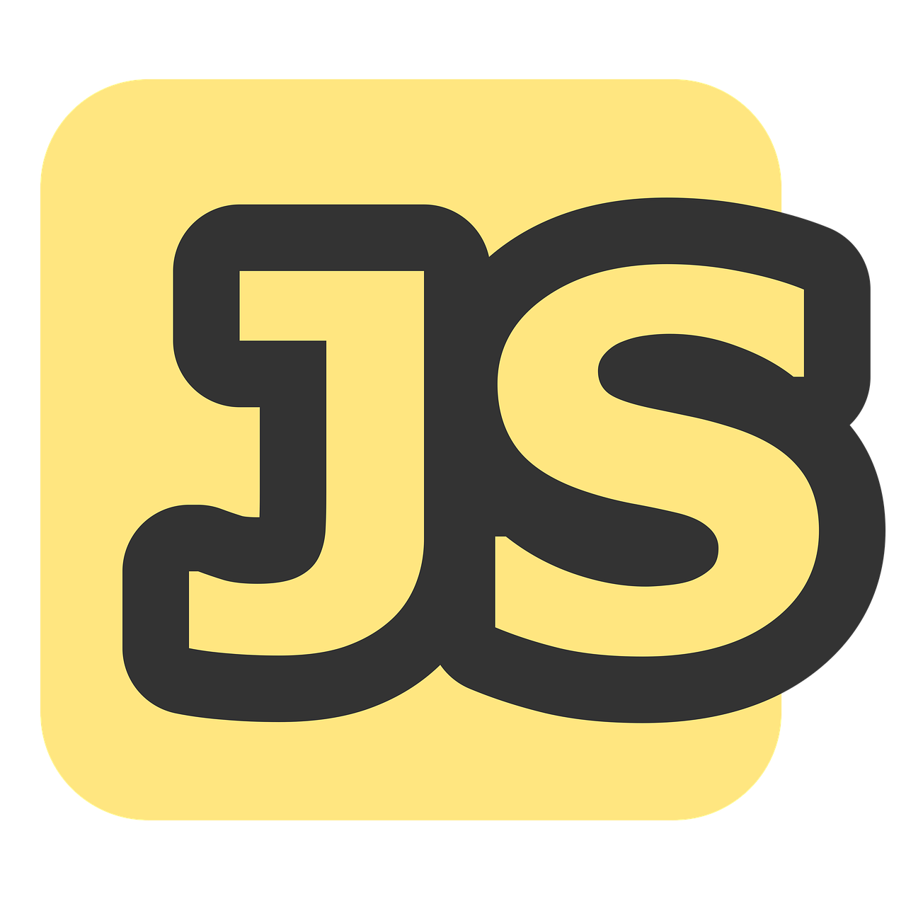

# App Web



Aplicação desenvolvida para demonstrar o uso do EJS no curso técnico de desenvolvimento de sistemas.

## Índice

- [Introdução](#introdução)
- [Instalação](#instalação)
- [Uso](#uso)
- [Funcionalidades](#funcionalidades)
- [Dependências](#dependências)
- [Configuração](#configuração)
- [Documentação](#documentação)
- [Exemplos](#exemplos)
- [Contribuidores](#contribuidores)
- [Licença](#licença)

## Introdução

Este projeto é uma aplicação web simples que utiliza EJS (Embedded JavaScript Templating) para renderizar páginas dinâmicas no lado do servidor. Foi criada como parte do curso técnico de desenvolvimento de sistemas para ilustrar o uso do EJS na construção de aplicações web.

## Instalação

1. Clone o repositório:

   ```bash
   git clone https://github.com/leonardo-ggomes/app-web.git
   ```

2. Navegue até o diretório do projeto:

   ```bash
   cd app-web
   ```

3. Instale as dependências:

   ```bash
   npm install
   ```

## Uso

Para iniciar o servidor de desenvolvimento, execute:

```bash
npm start
```

O aplicativo estará disponível em `http://localhost:3000`.

## Funcionalidades

- Renderização de páginas dinâmicas usando EJS.
- Estrutura MVC (Model-View-Controller) para organização do código.

## Dependências

- [Express](https://expressjs.com/)
- [EJS](https://ejs.co/)

## Configuração

Certifique-se de que o Node.js está instalado em sua máquina. Nenhuma configuração adicional é necessária para este projeto.

## Documentação

Para mais informações sobre o uso do EJS com Express, consulte a [documentação oficial do EJS](https://ejs.co/) e a [documentação do Express](https://expressjs.com/).

## Exemplos

Exemplos de uso do EJS podem ser encontrados nos arquivos de visualização dentro do diretório `views`.

## Contribuidores

- Leonardo Gomes - [GitHub](https://github.com/leonardo-ggomes)

## Licença

Este projeto está licenciado sob a licença MIT. Consulte o arquivo [LICENSE](LICENSE) para obter mais informações. 
